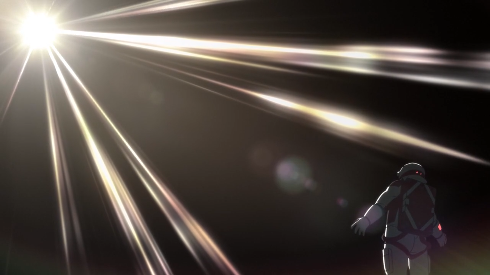

# Мой отпуск

## Полечу на *Луну*

---
## Проведу неделю на *космической станции*

---
## Приземлюсь на поверхность *Луны*
Финальным этапом моего путешествия будет спуск на поверхность Луны. И я узнаю что это за чувство, когда вокруг тебя мертвое безжизненое бесконечное пространсво, и от него тебя отделяет лишь несколько сантиметров стенки скафандра. Что это свобода или тюрьма? Ах, да, ну и самое главное сделать фоточек, например, вот таких:  